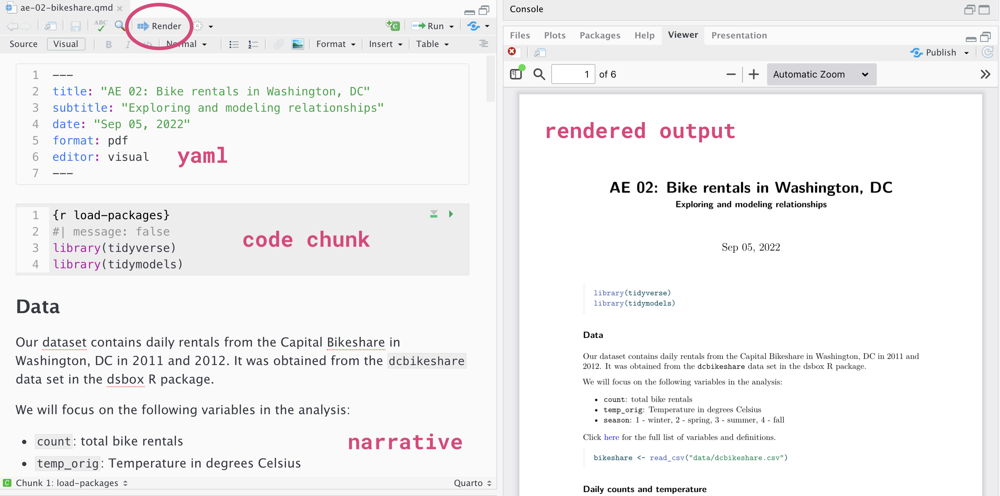

::: callout-important
## Due date

This lab is due **today, by the end of class**. To be considered on
time:

- `lab-01.qmd` committed and pushed to your GitHub repo before the exit
  ticket
- That same document, rendered to PDF, submitted on Gradescope
:::

# Introduction

In 1750 Tobias Mayer wanted to measure the libration of the moon — the
slight wobble that lets us see a bit around its edge. He took 27
observations, and each one gave him an equation in the same 3 unknowns.

**27 equations, 3 unknowns.** More information than he needed. That
sounds like good news.

It wasn't, and here's why: the 27 equations **contradict each other.**
There is no set of three numbers that satisfies all 27. There isn't even
a set that satisfies four of them. Every observation has a little error
in it, so every equation is slightly wrong, and they're all slightly
wrong in different directions.

At the same time, Leonhard Euler — a far greater mathematician than
Mayer — had 75 equations in 8 unknowns for the orbits of Jupiter and
Saturn. **He gave up.** He didn't believe you were allowed to combine
measurements that disagreed; he thought errors would pile up rather than
cancel.

Mayer wasn't a better mathematician. He just wasn't afraid of the data.
Today you find out what he did.

## Learning goals

By the end of this lab you will be able to...

- call functions, pass arguments by position and by name, and keep what
  they return.
- pull a column out of a data frame with `$`, and hand it to a function.
- tell a base R function from one written for this course, and read a
  course-written one when there is no help page to open.
- explain why 27 equations in 3 unknowns have no exact answer, and why
  base R will not even attempt one.
- reproduce Mayer's grouped-sum method and judge whether his grouping
  rule matters.
- commit and push your work to GitHub.

------------------------------------------------------------------------

# Part 1 —  together

## Getting your repo

::: callout-note
The rest of Part 1 is **not** group work and nothing in it is graded on
being right. **Laptops open, follow along, and stop me the second a step
doesn't do on your screen what it does on mine.** Everything after this
depends on this part working.
:::

**1 · Find the repo.** Go to the
[statistical-history](https://github.com/statistical-history)
organization on GitHub and click the repo whose name starts with
`lab-01`. This is your **first private repo** for this course — not the
public one from `lab-00`.

**2 · Copy the SSH address.** Green **Code** button. Make sure **SSH**
is selected — the label should read *Clone with SSH* and the address
should start with `git@github.com:`, **not** `https://`. Copy it.

**3 · Make it a project.** In RStudio: **File → New Project → Version
Control → Git**. Paste the address into **Repository URL**, leave the
directory name as it fills itself in, click **Create Project**. RStudio
clones the repo and opens it. You should see `lab-01.qmd`, a `data/`
folder, and `lab-01-helpers.R` in the **Files** pane.

**4 · Put your name in it.** Open `lab-01.qmd` and look at the very top,
between the two `---` lines. That block is the **YAML** — it holds the
document's title, author, and formatting options, not its content.
Change the subtitle so it has your group's card and put your names in
`author`.

**5 · Render it.** The **Render** button at the top of the Source pane.
**A PDF appears** — `lab-01.pdf`, in the same folder. That's the file
you were just looking at, turned into something readable, and it is
exactly the file you'll hand in. Render often; it's how you find out
early that a chunk is broken.

**6 · Commit and push.** Git pane (top right, its own tab, next to
Environment). Your changed `lab-01.qmd` is listed and `lab-01.pdf` is
added. Tick the box to **stage** it, write a message — *"Added our
names"*, not *"updates"* — click **Commit**, then click **Push**.

::: callout-important
## Step 6 is the one that matters — verify it

Open your repo's page on GitHub and **refresh**. You should see your
commit message and your own names sitting there.
:::

::: callout-tip
## Your repo isn't in the organization?

Most likely your entry survey response is still processing, or the
GitHub username you gave doesn't match your actual account. **Say so
now** — don't work around it and end up with nothing to push.
:::

::: callout-tip
## Step 2 gave you an `https://` address?

Switch it to SSH before you clone. An `https://` address asks for a
password on every single push and will not accept your GitHub password.
:::

## Where the text goes and where the code goes

Now that everyone has the file open — this is what you're looking at.

{fig-alt="Screenshot of a Quarto document, labelled with its YAML header, markdown text, and a code chunk, alongside the rendered document it produces."
fig-align="center"}

A `.qmd` file has exactly three kinds of thing in it:

| Part | What it is | Where you type |
|------------------------|------------------------|------------------------|
| **YAML** | The block at the top between `---` lines. Title, author, options | Only when a step tells you to |
| **Text** | Ordinary writing. Answers, reasoning, anything in prose | Anywhere outside a chunk |
| **Code chunks** | The grey blocks that start ```` ```{r} ```` and end ```` ``` ````. R runs what's inside | **Only inside the grey** |

**Text typed inside a chunk is an error. Code typed outside a chunk is
just words.** That is the single most common thing to go wrong today,
and it looks like the file is broken when it isn't.

And here is the window it all lives in:

{fig-alt="Screenshot of RStudio IDE, labelled with its four main panes: Source, Console, Environment/History, and Files/Plots/Packages/Help."
fig-align="center"}

- **Source** (top left) — your open files, like `lab-01.qmd`. Where you
  write.
- **Console** (bottom left) — where code actually runs. You can type
  here too, but anything you want to keep goes in `lab-01.qmd` instead.
- **Environment / History** (top right) — everything you've made so far
  this session. The **Git** pane is a tab here.
- **Files / Plots / Packages / Help** (bottom right) — your project's
  files, your plots, and R's documentation.

## Committing, for the rest of the day

You just did it once. Two things worth knowing for the next hour:

- **Render** updates the pdf. **Commit** saves a snapshot on your own
  machine. **Push** sends it to GitHub. You need to do all three.
- Before you stage a file, click it and click **Diff**. That shows what
  changed since the last commit — red is gone, green is new. It's how
  you catch an edit you didn't mean.

You'll be told to commit at several points today. With time, you'll
determine best times to commit and push on your own.

# Part 2 — Your first R, also together

## The assignment arrow

```{r}
#| label: assignment-demo
total <- 6
```

**Nothing printed.** `<-` is the **assignment arrow**: it says *take the
thing on the right and store it under the name on the left.* It stores
instead of showing. To see what's in something, type its name on its own
line:

```{r}
#| label: recall-demo
total
```

Objects live in your R session, not inside the chunk that made them — so
every chunk below can use `total` now, and so can the console. **This is
also why chunk order matters:** a chunk that uses `total` fails if you
run it before the chunk that creates `total`.

## Putting several things together: `c()`

```{r}
#| label: vector-demo
rows <- c(1, 2, 3)
rows
```

`c()` is short for **combine**. It takes several values **of the same
type** and makes them one **vector**. So `c(1, 2, 3)` is *one* thing
holding three numbers — not three separate things. You'll hand vectors
to functions constantly, starting in about ten minutes.

You just called your first function — `c()` — and nearly everything you
do in R for the rest of the semester is a function call too. Next week's
homework leans on this heavily, so here is what a call actually is
before you meet twenty more of them.

## What a call is made of

```{r}
#| label: anatomy
sum(c(1, 2, 3))
```

- **`sum`** is the function's **name**.
- **`()`** are what make it *run*. Typing `sum` on its own doesn't add
  anything up — it just shows you the function itself. The parentheses
  are the "do it now" part.
- **`c(1, 2, 3)`** is an **argument** — the input you're handing over.
  Some functions take none, some take several separated by commas.
  - `c()` is itself a function, and one you'll use constantly. Its name
    is short for **combine** (sometimes said as *concatenate*). It takes
    several elements **of the same type** and puts them together into a
    single **vector**. So `c(1, 2, 3)` is *one* vector holding three
    numbers — not three separate arguments to `sum()`.
- The function hands something **back**. Here that's the number `6`.

What comes back vanishes unless you catch it, so most of the time you
assign it a name:

```{r}
#| label: assigning
total_sum <- sum(c(1, 2, 3))
```

Arguments can be given **by position** or **by name**. These two are the
same call:

```{r}
#| label: named-arguments
round(3.14159, 2)
round(3.14159, digits = 2)
```

Naming them is slower to type and much easier to read. When a function
takes more than two arguments, name them.

## Three kinds of function, and only one of them has a help page

| Kind | Examples | Where it comes from | Does `?name` work? |
|------------------|------------------|------------------|------------------|
| **Base R** | `sum()`, `solve()`, `lm()`, `read.csv()` | Built into R. Always available | **Yes** — try `?sum` |
| **From a package** | none today | You `install.packages()` once, then `library()` each session | Yes, once loaded |
| **Written for this course** | `solve_rows()`, and a pile more next week | A `.R` file we hand you. You run `source()` on it | **No.** It exists nowhere else |

That third row is the we will mostly use today and in homework 1. They
are not magic and they are not advanced — each one is a few lines of
ordinary R that you could have written, packaged up so that a whole
procedure fits in one line.

The catch: `?solve_rows` won't work, and searching the internet for it
won't either. If you want to know what one does, **open the file and
read it** — which is exactly what you'll do in Part 4.

# Part 3 — The data

## Loading the data

```{r}
#| label: load-data
practice_df <- read.csv("data/practice_equations.csv")
dim(practice_df)
head(practice_df)
```

`read.csv()` reads the file; `<-` stores it as `practice_df`; `dim()`
says how big it is and `head()` shows the top of it. **27 rows and 5
columns.**

## What one row actually says

Each row is **one equation**. Its four number columns are things you
**measured**, and they sit in front of three unknowns you are trying to
**find**:

$$a_i \times x_1 \;+\; b_i \times x_2 \;+\; c_i \times x_3 \;=\; \texttt{rhs}_i$$

The subscript $i$ is the row number: every row brings its own $a_i$,
$b_i$, $c_i$ and $\texttt{rhs}_i$. **The unknowns carry no subscript, on
purpose** — $x_1$, $x_2$ and $x_3$ are the same three numbers in all 27
rows.

So take row 1, which reads `1, 1, 5, -4, 1403`:

| `obs` |   `a` |   `b` |    `c` |    `rhs` |
|-------|------:|------:|-------:|---------:|
| 1     | **1** | **5** | **−4** | **1403** |

and that row **is** this equation:

$$1 \times x_1 \;+\; 5 \times x_2 \;-\; 4 \times x_3 \;=\; 1403$$

One equation, three unknowns — not solvable on its own. Row 2 is a
different equation about **the same three numbers**. So is row 27.

::: callout-important
## What you are actually holding

**27 equations. 3 unknowns.** More equations than unknowns, and **the 27
equations contradict each other.** Every observation carries a little
error, so every equation is slightly wrong, and they're all wrong in
different directions. There is no set of three numbers that satisfies
all 27 — there isn't even a set that satisfies four of them.
:::

::: callout-important
## These numbers are made up.

`practice_equations.csv` is **not** Mayer's data. We built it. Same
shape as his table (27 equations, 3 unknowns, a constant term, errors
that stop any three numbers from satisfying all 27). **Homework 1 uses
Mayer's real table**.
:::

------------------------------------------------------------------------

## Getting one column out: `$`

```{r}
#| label: dollar-demo
practice_df$rhs
sum(practice_df$rhs)
```

`$` pulls **one column out of a data frame by name**, and what comes
back is a **vector** — the same kind of thing `c(1, 2, 3)` made earlier.

**Next week's homework asks you for `sum(group_I$constant_arcminutes)`**
— a data frame, one column pulled out of it by name, and those nine
numbers added up.

# Part 4 — Lab 01's helpers

## Try them

Four of them, in `lab-01-helpers.R`. Load the file, then run the first
three.

```{r}
#| label: source-helpers
source("lab-01-helpers.R")
```

`source()` is base R. It means "run every line of that file" — which,
for a file that contains only function definitions, means all four
functions now exist and you can call them. **Nothing appears when it
works.** If you later get `could not find function "solve_rows"`, this
line is what didn't run.

```{r}
#| label: check-data
#| message: true
check_equations(practice_df)
```

This one checks the file you loaded is the one this lab expects. **No
news is good news** — if something were wrong it would stop and tell
you.

```{r}
#| label: show-equation
show_equation(practice_df, 1)
show_equation(practice_df, 4)
```

Row 1 of a CSV is not obviously an equation. This writes out the same
thing you saw in Part 3 — `1 * x1 + 5 * x2 - 4 * x3 = 1403` — straight
from the row. Try a few other row numbers.

::: callout-note
## R counts from 1

`show_equation(practice_df, 1)` gives you the **first** row, and
`practice_df` has 27 rows numbered 1 through 27. If you've written
Python, Java, C, or JavaScript before, this is the opposite of what
you're used to: those languages start at 0, so their "first" element is
number 0 and their last is number *n* − 1.

R starts at 1 and goes to *n*, which matches how the rest of the course
talks — "equation 1" is `practice_df[1, ]`, and the last one is
`practice_df[27, ]`. Two things that catch people coming from those
other languages: `practice_df[0, ]` isn't an error, it just hands back
an empty result, which is a confusing way to discover you were off by
one; and a negative number doesn't count from the end, it means *drop* —
`practice_df[-1, ]` is all 27 rows **except** the first.
:::

```{r}
#| label: solve-rows-helper
solve_rows(practice_df, c(1, 2, 3))
```

Three unknowns, from equations 1, 2, and 3 — which is exactly what
Exercise 2 is about to have you do by hand.

## Reading a function definition

For this lab and Homework 01, all you need to do is **call** a function
and know what it does. Reading the definition is how you find out what
it does — so it's worth learning to read one, even before you write one.
Here's the shape, stripped down:

```{r}
#| label: definition-anatomy
#| eval: false
sum_rows <- function(equations, rows) {   # name <- function(inputs) {
  c(colSums(equations[rows, c("a", "b", "c")]),
    rhs = sum(equations$rhs[rows]))       #   the last value is what comes back
}                                         # }
```

That is the real `sum_rows()` from `lab-01-helpers.R`, minus its two
error checks — you'll call it in Exercise 3.

`function(equations, rows)` says "this takes two inputs, and inside here
I'll call them `equations` and `rows`." Everything between the braces is
the body. Whatever the body's last line evaluates to is what the
function hands back. So `sum_rows(practice_df, group1)` runs that body
with `equations` set to `practice_df` and `rows` set to `group1`.

::: callout-note
Notice the argument is called `equations` inside the definition but you
pass it `practice_df`. **That's not a mistake.** A function names its
own inputs; what you hand in keeps its own name outside. These helpers
would work on any table shaped like ours, which is why they aren't named
after ours.
:::

R lets you say that last part out loud with `return()`, and many
languages *require* it. These two definitions behave identically:

```{r}
#| label: return-explicit
#| eval: false
add_one <- function(x) {
  x + 1              # last value evaluated, so it's what comes back
}

add_one <- function(x) {
  return(x + 1)      # says the same thing explicitly
}
```

------------------------------------------------------------------------

# Part 5 — Exercises

**Goal:** turn 27 contradictory equations into a single, defensible
claim about 3 unknown quantities — and understand why that turn was
Mayer's invention, not the arithmetic after it.

## 1. Predict

**In your groups. Agree on an answer, then we vote as a room.** Write it
in `lab-01.qmd` **before you run anything.**

> **Prediction.** You're about to draw 3 of the 27 equations and solve
> them exactly. The group next to you draws a *different* 3. How much
> will the two answers disagree?
>
> **(a)** essentially the same three numbers **(b)** different in size,
> but pointing the same way **(c)** far enough apart that even the
> **signs** could disagree

## 2. Draw three equations and solve them

### Draw them

**Each group draws three numbered slips.** Not 1, 2, 3 — whatever you
draw. Write the three numbers down; you'll need them twice.

### Solve them

Here's the shape of it, using rows 1, 2, 3:

```{r}
#| label: solve-three
solve_rows(practice_df, c(1, 2, 3))
```

One call: hand it the table and three row numbers, get back the three
unknowns. `solve_rows()` is one of the course-written functions, so
**open `lab-01-helpers.R` and read it.**

Inside you'll find three ordinary lines: pull out those rows, pull out
their right-hand side, solve. **Now do it with the three equations you
drew**, using `solve_rows()`.

### Put it on the board

Each time, write these on the board and then in `lab-01.qmd`:

|  |  |
|------------------------------------|------------------------------------|
| **The three equation numbers you drew** | so we can see nobody had the same three |
| **The three numbers you got** | $x_1$, $x_2$, $x_3$ |

**Four groups — J, Q, K, A — four rows.**

::: callout-tip
## Now look at the board — this is the whole of Chapter 1

Check the board against Prediction 1.
:::

::: render-commit-push
Commit and push now: *"solved our three equations."* Everyone in your
group does this on their own machine — this course has no
driver/navigator split, you all type everything.
:::

## 3. Mayer's fix

Mayer's idea: **don't throw 24 equations away. Add them up.**

Sort the 27 equations into three groups of nine, add each group together
to make one equation, and solve the resulting 3×3.

His rule for *how* to sort them: put equations in different groups when
their measured $b$ values are **as different as possible**. Note that
this is a rule about the *measured numbers*, not about the answers — he
sorts on a column he can read straight off the table, and chooses his
groups before he knows what they'll give him.

### Sorting, and what `group1` actually holds

```{r}
#| label: mayer-grouping-setup
ordered_rows <- order(practice_df$b)

group1 <- ordered_rows[1:9]
group2 <- ordered_rows[10:18]
group3 <- ordered_rows[19:27]

group1
```

::: callout-important
## `group1` is a list of row numbers — not equations, not answers

`order()` doesn't sort the data. It hands back **the row numbers, in the
order that would sort them** — so `ordered_rows` is all 27 row numbers
arranged from the most negative `b` to the most positive.

`ordered_rows[1:9]` then takes the first nine of *those numbers*. So
`group1` is nine **row numbers**: it means *"the nine equations with the
smallest `b`."* Printing `group1` above shows you exactly which nine,
and they are not 1 through 9.
:::

Here is the whole maneuver in one picture — 27 equations sorted, cut
into three groups of nine, each group added down into a single equation:

```{=html}
<!-- Schematic, not a chart: the bars are 27 equations in sorted order, so the
     three groups get three steps of ONE hue, light to dark, matching the sort.
     Each group is also labelled, so identity never rests on colour alone. -->
<svg viewBox="0 0 780 470" role="img" aria-labelledby="mg-t mg-d"
     style="width:100%;max-width:780px;height:auto;display:block;margin:1rem auto;
            background:#ffffff;border:1px solid #d8d3c8;border-radius:6px">
  <title id="mg-t">Mayer's grouping</title>
  <desc id="mg-d">Twenty-seven equations sorted by their measured b value, cut into three
  groups of nine. Each group is added together column by column to make one equation, giving
  a three-by-three system.</desc>
  <g font-family="Helvetica Neue, Helvetica, Arial, sans-serif">
    <text x="40" y="32" font-size="13" font-weight="700" fill="#001a57">27 equations, sorted by b</text>
    <text x="40" y="48" font-size="11" fill="#596574">smallest at the top</text>
    <text x="530" y="32" font-size="13" font-weight="700" fill="#001a57">3 summed equations</text>
    <text x="530" y="48" font-size="11" fill="#596574">one per group &#8212; a 3&#215;3 system</text>

    <!-- 27 rows. Fill steps light to dark with the sort; each group is labelled. -->
    <!-- group 1 -->
    <g fill="#c6dced" stroke="#0064a8" stroke-width="0.75">
      <rect x="150" y="60"  width="230" height="11" rx="2"/>
      <rect x="150" y="73"  width="230" height="11" rx="2"/>
      <rect x="150" y="86"  width="230" height="11" rx="2"/>
      <rect x="150" y="99"  width="230" height="11" rx="2"/>
      <rect x="150" y="112" width="230" height="11" rx="2"/>
      <rect x="150" y="125" width="230" height="11" rx="2"/>
      <rect x="150" y="138" width="230" height="11" rx="2"/>
      <rect x="150" y="151" width="230" height="11" rx="2"/>
      <rect x="150" y="164" width="230" height="11" rx="2"/>
    </g>
    <text x="140" y="121" font-size="12" font-weight="700" fill="#001a57" text-anchor="end">group1</text>
    <text x="140" y="136" font-size="10" fill="#596574" text-anchor="end">9 rows</text>

    <!-- group 2 -->
    <g fill="#0064a8" stroke="#00396a" stroke-width="0.75">
      <rect x="150" y="185" width="230" height="11" rx="2"/>
      <rect x="150" y="198" width="230" height="11" rx="2"/>
      <rect x="150" y="211" width="230" height="11" rx="2"/>
      <rect x="150" y="224" width="230" height="11" rx="2"/>
      <rect x="150" y="237" width="230" height="11" rx="2"/>
      <rect x="150" y="250" width="230" height="11" rx="2"/>
      <rect x="150" y="263" width="230" height="11" rx="2"/>
      <rect x="150" y="276" width="230" height="11" rx="2"/>
      <rect x="150" y="289" width="230" height="11" rx="2"/>
    </g>
    <text x="140" y="246" font-size="12" font-weight="700" fill="#001a57" text-anchor="end">group2</text>
    <text x="140" y="261" font-size="10" fill="#596574" text-anchor="end">9 rows</text>

    <!-- group 3 -->
    <g fill="#001a57" stroke="#00102f" stroke-width="0.75">
      <rect x="150" y="310" width="230" height="11" rx="2"/>
      <rect x="150" y="323" width="230" height="11" rx="2"/>
      <rect x="150" y="336" width="230" height="11" rx="2"/>
      <rect x="150" y="349" width="230" height="11" rx="2"/>
      <rect x="150" y="362" width="230" height="11" rx="2"/>
      <rect x="150" y="375" width="230" height="11" rx="2"/>
      <rect x="150" y="388" width="230" height="11" rx="2"/>
      <rect x="150" y="401" width="230" height="11" rx="2"/>
      <rect x="150" y="414" width="230" height="11" rx="2"/>
    </g>
    <text x="140" y="371" font-size="12" font-weight="700" fill="#001a57" text-anchor="end">group3</text>
    <text x="140" y="386" font-size="10" fill="#596574" text-anchor="end">9 rows</text>

    <!-- arrows: each group adds down into one equation -->
    <defs>
      <marker id="ar" viewBox="0 0 10 10" refX="9" refY="5" markerWidth="7" markerHeight="7" orient="auto">
        <path d="M0,0 L10,5 L0,10 z" fill="#596574"/>
      </marker>
    </defs>
    <g stroke="#596574" stroke-width="1.5" fill="none" marker-end="url(#ar)">
      <path d="M392,117 H510"/>
      <path d="M392,242 H510"/>
      <path d="M392,367 H510"/>
    </g>
    <g font-size="10" fill="#596574" text-anchor="middle">
      <text x="451" y="110">add down</text>
      <text x="451" y="235">add down</text>
      <text x="451" y="360">add down</text>
    </g>

    <!-- the three summed equations -->
    <rect x="520" y="104" width="220" height="26" rx="3" fill="#c6dced" stroke="#0064a8"/>
    <text x="630" y="121" font-size="11" font-weight="700" fill="#001a57" text-anchor="middle">sum_rows(practice_df, group1)</text>
    <rect x="520" y="229" width="220" height="26" rx="3" fill="#0064a8" stroke="#00396a"/>
    <text x="630" y="246" font-size="11" font-weight="700" fill="#ffffff" text-anchor="middle">sum_rows(practice_df, group2)</text>
    <rect x="520" y="354" width="220" height="26" rx="3" fill="#001a57" stroke="#00102f"/>
    <text x="630" y="371" font-size="11" font-weight="700" fill="#ffffff" text-anchor="middle">sum_rows(practice_df, group3)</text>

    <text x="630" y="404" font-size="11" fill="#596574" text-anchor="middle">3 equations, 3 unknowns &#8212;</text>
    <text x="630" y="419" font-size="11" fill="#596574" text-anchor="middle">and this one has an exact answer</text>
  </g>
</svg>
```

### Doing it

`sum_rows()` is the fourth helper in `lab-01-helpers.R`. It takes the
data and some row numbers, adds those rows up column by column, and
hands back **one equation**:

```{r}
#| label: sum-one-group
sum_rows(practice_df, group1)
```

Four numbers: the summed $a$, $b$ and $c$, and the summed right-hand
side. That is one equation. Do it three times and stack the results:

```{r}
#| label: mayer-solve
M <- data.frame(rbind(sum_rows(practice_df, group1),
           sum_rows(practice_df, group2),
           sum_rows(practice_df, group3)))

answer <-solve_rows(M, c(1:3))
answer
```

**One answer, from all 27 equations.** I'll put that one on the board
next to your four.

## 4. The modern tool

It's a one-liner black box you'll learn about soon in the course. For
now the point is only that a third answer exists.

```{r}
#| label: lm-comparison
fit <- lm(rhs ~ b + c, data = practice_df)
coef(fit)
```

All 27 rows, no grouping, no choosing. **A different answer again.**

It is better than Mayer's, in a specific sense — but that sense doesn't
exist yet in this book. It gets invented in Chapter 4. **Hold the
question.**

::: render-commit-push
Commit and push: *"Mayer's grouping and lm()."*
:::

## 5. Debrief

You have three kinds of answer in front of you. **Look at all three
before you say anything.**

### One — the four answers from three equations each

One draw per group, four sets of three numbers on the board.

- **How different are they from each other?** Put a number on it if you
  can — how far apart are the largest and smallest $x_2$?
- Every one of those four is **exactly correct** for the three equations
  that produced it. So what is it that's actually wrong?
- **Nobody drew badly.** Is there a set of three you could have drawn
  that would have been the right three?

### Two — how do they compare to Mayer's answer?

One solution from all 27 equations.

- **Where does it sit relative to the four?** In among them? Off to one
  side?
- If you'd only ever seen your own group's three-equation answer, would
  you have had any way to know it was off?

### Three — how do they compare to `lm()`?

- Mayer's grouped answer and `lm()` both used **all 27** equations.
  **How close are they to each other**, compared with how close the four
  are to each other?

### Prediction 1 — settled

You predicted how far apart two groups' three-equation answers would be.
**The board is the answer**, and it's sitting right there. Check what
your group wrote against it.

### What happens next

Four answers is not much to reason from, and you only tried one way of
grouping. **The homework does both at scale**, on Mayer's real 27
equations:

| You did | The homework does |
|------------------------------------|------------------------------------|
| 4 answers from three equations each | **1,000** of them |
| **1** grouping — Mayer's own sorted one | **1,000 random regroupings**, plus a third rule: one equation from each of Mayer's groups — and the question of whether his sorting rule mattered at all |

# Part 6 — AI slot

::: render-commit-push
**Commit and push:** Good moment for the Git pane to go empty.
:::

The governing rule of this course is that you may not submit a line of
code you can't explain. So the genuinely useful thing to ask a model
for, today, is not code — it's an **explanation**. You're going to ask
for the same explanation twice. The function stays the same both times;
the only thing that changes is the prompt.

Open `lab-01-helpers.R` and find **`show_equation()`**. That is the
function for both prompts. You've already run it — Section 3 — so you
know what it produces.

### Prompt 1 — the one you'd actually type

> *Explain this R function.*

### Prompt 2 — the same question, specified

> *I've never written R and I'm new to coding — assume I know what a
> variable is and nothing else. Walk through this function step by step.
> One sentence per step, and name every R function it uses. Then tell me
> what goes in and what comes out, and what kind of thing each one is —
> a number, a table, a piece of text, one of them or many. Then invent a
> small input and trace it through in a table, one row per step, ending
> at the value the function hands back. No summary, no suggested
> improvements, and don't rewrite the code.*

::: callout-tip
Copy both prompts off this page rather than retyping them, and paste
`show_equation()` underneath each one.
:::

------------------------------------------------------------------------

### Think — on your own

Run both prompts. Read both answers. **Don't talk to anyone yet.**

Then write down, in `lab-01.qmd`, **before you discuss it**: one thing
the second answer told you that the first didn't. Which part of the
prompt helped pin down that part?

### Group — the four of you

Share your thoughts with the group. Write down what your group agreed
on.

### Share — whole class

::: callout-important
**What did Prompt 2 pin down that Prompt 1 left open?**

One from each group.
:::

Prompt 2 isn't longer for the sake of it, and it isn't a magic phrase to
save and reuse. Every clause in it is a decision the model was going to
make either way. Unasked, it makes them for the average person who
pastes in code — who is not you.

::: render-commit-push
**Render and commit again. Push**.
:::

# Part 7 — Exit ticket

On paper, handed in as you leave :

1.  Muddiest point?
2.  One thing you'd want to try in R next.
3.  Any plans for the weekend?

Make sure your name is on it as this is how attendance is taken.

------------------------------------------------------------------------

# Submission

::: callout-warning
Before you leave, make sure `lab-01.qmd` is fully committed and pushed.
Check your Git pane: it should be **empty**. If it isn't, something
didn't push, and that's the thing to fix before the exit ticket, not
after.

You must also **submit `lab-01.pdf` on Gradescope** before the deadline
for full credit. That's the file the **Render** button already made for
you — this document renders straight to PDF, so there is no separate
export step and nothing to combine. Render once more at the end so the
PDF matches your final text.
:::

To submit on Gradescope:

- Click on the assignment, and you'll be prompted to submit it.
- Mark the pages associated with each exercise — every page starting
  from Part 5 on of your submission should be associated with at least
  one question.
