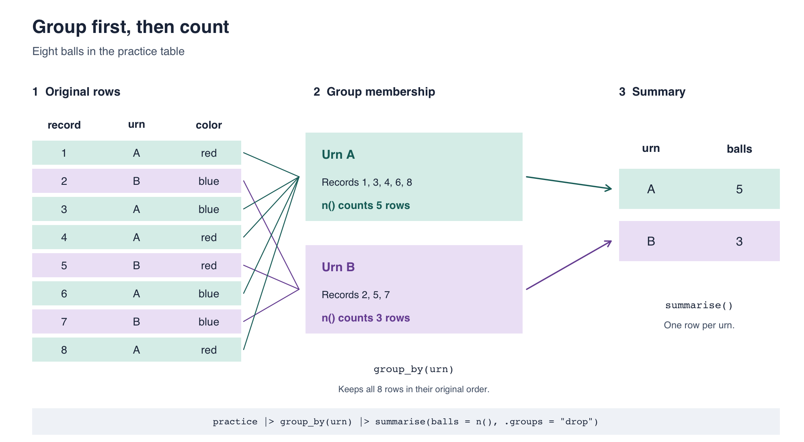

::: callout-important
## Due date

This lab is due **today, by the end of class**. Commit and push your
`lab-04.qmd` and rendered PDF to your own lab repo, and submit that PDF
on Gradescope.
:::

# Introduction

Today we will use two questions to practice conditional
probability: **Among balls in urn A, what proportion are red?** And
**among red balls, what proportion are in urn A?** The same data answer
both questions, but we need a different denominator for each.

Before calculating anything, we need to organize the records. Today's
job is to make R build the tables for us. We will build a count table, calculate joint and conditional proportions
by hand, and then make R reproduce those calculations. Each pipeline
should tell us both **what we counted and what we divided by**.

## Learning goals

By the end of this lab you will be able to:

- read an R pipeline from top to bottom;
- distinguish sorting, grouping, and summarizing;
- build a count table with `group_by()` and `summarise()`, or `count()`;
- read a 2×2 count table;
- calculate joint and conditional probabilities with the right denominator;
- explain why filtering before or after calculating a proportion matters.

# Opening activity

**Laptops closed. Stay with your group and keep your card visible.**
We will use the 16 cards J, Q, K, and A in all four suits, with one card
per person. Imagine selecting one person uniformly at random from the
class. Let $A$ denote the event that their card is an Ace; similarly,
$J$, $Q$, and $K$ denote Jack, Queen, and King. Write suits as
$\text{Heart}$, $\text{Spade}$, and $\text{Club}$.

For each probability, decide together:

- **Denominator:** Who is eligible to be counted? Those people stand.
- **Numerator:** Among those standing, who satisfies the event? Those
  people raise their cards.
- **Probability:** What fraction does this give?

Everyone sits back down between rounds. A different member of each
rank group should explain its reasoning each time.

1. **Start with the whole population:**
   $$P(A),\quad P(J),\quad P(Q),\quad P(K).$$
   Who belongs in the denominator for each probability? Take turns having
   each rank group raise its cards, and report the count for each group.
   We have **grouped by card rank and counted**. How do we turn those
   counts into the four probabilities?
2. **Condition on rank:**
   $$P(\text{Heart}\mid K).$$
   What does the condition after the bar tell us about who should stand?
3. **Reverse the condition, keeping the same two events:**
   $$P(K\mid\text{Heart}).$$
   Who stands now? Compare the numerator and denominator with the previous
   round: which people are the same, and which have changed?
4. **An “or” inside a condition:**
   $$P(J\text{ or }Q\mid\text{Spade}).$$
   Who is eligible, and which
   eligible people satisfy at least one of those events?
5. **An “and,” with no condition:**
   $$P(J\text{ and Club}).$$
   Does the suit restrict the
   denominator here, or is it part of the event counted in the numerator?

**Discuss:** Did reversing the condition in rounds 2 and 3 change the
probability? Does that mean reversed conditional probabilities must
always agree? Explain using the populations you counted, then keep the
question in mind for the urn activity.

::: callout-tip
## From people to R

In round 1, grouping by card rank illustrates `group_by()`, and reporting
each group's count illustrates `summarise(n = n())`. Dividing those counts
by the whole population gives the four rank probabilities.
Choosing who stands illustrates `filter()`: keep only
those meeting a condition. The people standing determine the denominator;
raising a card identifies successes within that population.
:::

This is an in-class discussion; there is nothing to enter in your template.

## Now open your laptops — Getting your repo

Find your repo beginning with `lab-04` in the
[statistical-history organization](https://github.com/statistical-history).
Clone it in RStudio using **File → New Project → Version Control → Git**
and its SSH address. If you have already cloned it, open that project
and **Pull**.

Open `lab-04.qmd`, enter your name and group, and render once. You should
also see `data/urn_records.csv`. Keep these instructions beside your
working document. Everyone runs the code in their own repo.

# Part 1 — Predict before running

The template includes eight practice records:

| Record | Urn | Color |
|---:|:---:|:---|
| 1 | A | red |
| 2 | B | blue |
| 3 | A | blue |
| 4 | A | red |
| 5 | B | red |
| 6 | A | blue |
| 7 | B | blue |
| 8 | A | red |

**1.1** Suppose R produces one row per **urn**. How many rows will that
table have? What if it produces one row per **urn-and-color combination**?
Write both predictions before running anything.

# Part 2 — A new way to talk to a data frame

## Load the package

A package is a collection of R tools. The **tidyverse** is a collection
of packages that work together. We will mainly use **dplyr**, its data
manipulation package. `library(tidyverse)` makes these tools available
in the current R session; it belongs in your document so Render loads
them too. If it reports that the package is missing, tell the instructor.

```{r}
#| label: setup
library(tidyverse)
```

The template constructs the eight records with `tibble()`, a tidyverse
version of a data frame. You do not need to retype them.

## Read the pipe as “then”

```{r}
#| label: first-pipe
practice |>
  filter(urn == "A")
```

Read this as **take `practice`, then keep rows whose urn is A**. The
pipe `|>` passes the result on its left into the function on its right.
This is another way to write `filter(practice, urn == "A")`.

Inside these functions, write `urn` rather than `practice$urn`. Column
names are unquoted; text values such as `"A"` need quotation marks.
`==` asks whether values are equal. `<-` saves a result under a name.

**2.1** Change the filter to keep blue records. How many rows remain?
Did running a filter change the original `practice` object? Print
`practice` to check.

## Sorting is not grouping

Run these separately:

```{r}
#| label: sorting-and-grouping
practice |>
  arrange(urn)

practice |>
  group_by(urn)
```

`arrange()` changes row order. `group_by()` records which rows belong
together for later calculations. **It does not collapse or sort the
rows.** Look for `Groups: urn [2]` above the printed grouped table.

**2.2** How many rows does each result have? Which command would you use
to put records from the same urn next to each other on the screen?

## Now summarize

```{r}
#| label: first-summary
practice |>
  group_by(urn) |>
  summarise(balls = n(), .groups = "drop")
```

`summarise()` makes one summary row per group. `n()` counts the rows in
the current group; `balls` is the name we chose for the output column.
`.groups = "drop"` makes the result an ordinary, ungrouped table so a
later calculation will not silently continue working within groups.

::: callout-tip
## Picture the groups

{fig-alt="The eight practice rows retain their original order. Urn A contains records 1, 3, 4, 6, and 8; urn B contains records 2, 5, and 7. group_by(urn) identifies these groups; summarise(balls = n()) returns two rows, A with 5 balls and B with 3." width="100%"}

The shading marks **urn membership**, not ball color. `group_by(urn)`
keeps all eight rows and tells R which belong together. Then
`summarise(balls = n())` counts the rows **within each group** and
returns one row per urn. The middle boxes illustrate membership;
they are not separate tables created by `group_by()`.
:::

**2.3** Compare the number of summary rows with your first prediction.
Then remove `group_by(urn)` and run the summary again. What does its
single row represent now?

**2.4** Modify the grouped version to group by **both** `urn` and
`color`: `group_by(urn, color)`. Compare with your second prediction.
Explain what one row now represents.

::: callout-warning
## Render, commit, and push

Render your document, then commit and push your work so far.
:::

# Part 3 — Build tables from a larger file

::: callout-note
## Constructed practice data

`urn_records.csv` is a **complete inventory of 120 balls in two urns**.
Each row describes one distinct ball, including which urn contains it
and whether it is red or blue. These 120 balls are our entire population.
The urns contain different numbers of balls.

This is a fictional population created for the lab. Each ball appears
exactly once. The file contains no missing values.
:::

```{r}
#| label: load-records
balls <- read_csv("data/urn_records.csv", show_col_types = FALSE)
glimpse(balls)
```

| Column | Meaning |
|---|---|
| `record` | Unique ball identifier|
| `urn` | `"A"` or `"B"`, the urn containing the ball |
| `color` | `"red"` or `"blue"`, the ball's color |

**3.1** Use `group_by()` and `summarise()` to count balls in each urn.
Call the count column `n`. Save the resulting table as `urn_totals`,
then print it. Check that its counts add to 120 with `sum(urn_totals$n)`.

## A shortcut for counting

For this ungrouped input, these two pipelines produce the same table:

```{r}
balls |>
  group_by(urn) |>
  summarise(n = n(), .groups = "drop")

balls |>
  count(urn)
```

`count()` names the count column `n` automatically. It is a shortcut
for a task you now know how to build from its parts.

**3.2** Use `count(urn, color)` to save a table named `urn_color`.
Print it and check its counts add to 120.

::: callout-tip
## Always ask what a row means

In `balls`, one row is one ball. In `urn_color`, one row is an
urn-and-color combination. Its `n` column says how many balls that
combination represents. Use `sum(n)` to total these counts: `n()` would
count table rows instead.
:::

# Part 4 — A 2×2 table, then pencil and paper

Use base R's `table()` to display the counts with urns down the rows
and colors across the columns:

```{r}
#| label: table-data
#| eval: true
#| include: false
balls <- read.csv("data/urn_records.csv")
```

```{r}
#| label: two-way-counts
#| eval: true
table(balls$urn, balls$color)
```

These are the same four counts as in `urn_color`, arranged in a 2×2
table. Use this table to calculate the probabilities below.

**4.1** Copy the counts into your template and add the row totals,
column totals, and grand total by hand. These totals will help you
choose the denominators.

## What probabilities are we calculating?

Imagine selecting **one of the 120 balls uniformly at random**: every
ball across the two urns has the same chance of being selected.
$P(A)$ is the probability that the selected ball is in urn A, and
$P(\text{red})$ is the probability that it is red. Because our table
contains every ball, its counts give these probabilities directly.

A **joint** probability asks whether two things are both true:
$P(A \text{ and red})$. Count the balls that satisfy both conditions,
but divide by **all 120 balls**.

A **conditional** probability restricts which balls we consider:
$P(\text{red}\mid A)$ asks about red **among A balls**. Keep only urn A,
then ask what fraction of those balls are red. The bar means “given.”
The denominator is now **the A row total**, not 120.

**4.2** Before using R to calculate probabilities, write a fraction for each. Write down the numerator and the denominator used for each calculation.
A calculator is fine; choose the counts from your table yourself.

| Question | Probability |
|---|---|
| The ball is from A | $P(A)$ |
| The ball is red | $P(\text{red})$ |
| The ball is from A **and** red | $P(A \text{ and red})$ |
| The ball is red **given** it is from A | $P(\text{red}\mid A)$ |
| The ball is from A **given** it is red | $P(A\mid\text{red})$ |

**4.3** The last three fractions share the same numerator. Why do they
have different denominators? Point to the relevant cell, row total,
column total, or grand total in your table.

::: callout-warning
## Render, commit, and push

Render your document, then commit and push before moving on.
:::

# Part 5 — Make R choose the same denominator

## Joint probabilities: divide by all balls

`mutate()` adds a column while keeping the existing rows. Here it adds
one probability for each urn-and-color combination:

```{r}
#| label: joint-probabilities
joint <- urn_color |>
  mutate(probability = n / sum(n))
joint
sum(joint$probability)
```

Note, we are using `urn_color` here, not the original `balls` table. `urn_color` is ungrouped. `sum(n)` adds all four counts, so every row is
divided by 120. The four probabilities describe mutually exclusive
combinations that cover every ball, so they add to 1.

```{r}
#| label: joint-a-red
joint |>
  filter(urn == "A", color == "red")
```

Two conditions separated by a comma in `filter()` must **both** be true.
This selects the A-and-red cell **after** its probability was calculated.

**5.1** Compare the A-and-red result with your hand calculation. Then
write a pipeline that selects the B-and-blue joint probability. State
its numerator and denominator.

## Conditional probabilities: filter first

To condition on A, keep A balls **before** counting and dividing:

```{r}
#| label: conditional-a
colors_given_a <- balls |>
  filter(urn == "A") |>
  count(color) |>
  mutate(probability = n / sum(n))
colors_given_a
```

Read the steps aloud:

1. Keep balls from A: this sets the group we are conditioning on.
2. Count the colors among those retained balls.
3. Divide each color count by the sum of those counts: the number of A balls.

The probabilities in this table add to 1 **within A**. Filtering for A
does not mean we already know the color: we keep both red and blue A
balls so they can both contribute to the denominator.

We can also start from the summary count table:

```{r}
#| label: conditional-a-from-counts
urn_color |>
  filter(urn == "A") |>
  mutate(probability = n / sum(n))
```

After filtering, only the two A counts remain. `sum(n)` now adds those
two counts. We do **not** call `count()` again on this table: its rows
already contain counts of balls.

**5.2** Compare both versions with your hand calculation of
$P(\text{red}\mid A)$. What denominator did they use? Why must we retain
the blue A balls until after division?

**5.3** Reverse the condition: starting from `balls`, keep **red** balls,
count **urns**, then add a `probability` column. Save this as `urns_given_red`.
Compare its A probability with your hand calculation of $P(A\mid\text{red})$.
What denominator does this pipeline use?

**5.4** Starting from `urn_color`, calculate the color probabilities
**given B**, then select the red row. Record the numerator and denominator.
Check that the two color probabilities add to 1 before selecting red.

# Part 6 — Same functions, different order

Run both pipelines. They display the same A-and-red count, but the
probability columns answer different questions.

```{r}
#| label: divide-then-filter
urn_color |>
  mutate(probability = n / sum(n)) |>
  filter(urn == "A", color == "red")
```

```{r}
#| label: filter-then-divide
urn_color |>
  filter(urn == "A") |>
  mutate(probability = n / sum(n)) |>
  filter(color == "red")
```

**6.1** For each pipeline, write down which rows are present **at the
moment `sum(n)` runs**, the denominator, the resulting probability, and
the question it answers. Match the results to Part 4.

**6.2** A teammate filters to `urn == "A", color == "red"` **before**
`mutate(probability = n / sum(n))` and gets 1. Explain why. Which
pipeline above should they use if they want the chance of red given A?


# Part 7 — AI ethics: whose mistake is it?

You do not need an AI tool for this discussion. Start with a situation
that could happen in your own group, then consider what changes when
an error reaches a public audience. **Both scenarios are fictional.**

## Round 1 — The group project

Four students complete a project together. They divide the work: one
cleans the data, one analyzes it, one makes the figures, and one writes
the report. Everyone's name goes on the final submission.

The student doing the analysis uses AI to help write the code. AI use
is allowed, and they tell their teammates they used it. The code runs,
but it uses the wrong denominator. The student does not catch the
mistake. The figures and report repeat the incorrect result. Everyone
reads the final report, but nobody checks the analysis against the data.
The group submits the project and learns about the error afterward.

**7.1 — Who is responsible?** Is responsibility limited to the student
who ran the analysis, shared equally, or shared in different ways?
Decide as a group and explain. Does dividing up the work also divide
responsibility for the finished project? Distinguish who should have
caught the mistake, who should help fix it, and who should lose credit,
if anyone. Those do not have to be the same answer.

**Follow-up:** Would your answer change if that student had written the
same incorrect code without AI? What if a teammate had specifically
asked whether the denominator had been checked and been told “yes”?

## Round 2 — Now it is published

Imagine that a student journalist writes an article for *The Chronicle*
about teaching evaluations at Duke. They use AI to analyze the ratings
and turn the results into a chart. An editor reviews the article and
approves publication, but nobody checks the rating scale against the
original survey.

In this fictional story, **Kat's ratings are all 5 out of 5, naturally**.
The AI assumes the scale runs from 0 to 10 and labels her average as
“50% of the maximum rating.” The article presents this as evidence of
poor teaching. Readers share the chart, and students decide not to sign
up for Kat's classes.

The error is discovered. The article is corrected, with a note explaining
that the original analysis used the wrong scale. But screenshots of
the original chart are already circulating.

**7.2 — Who owns the published claim?** What responsibility belongs to
the journalist, the editor, the publication, and the AI provider? Do
not assume all four have the same role or the same ability to check
this particular analysis. Does saying “the AI made the mistake” settle
anyone's responsibility? Name one concrete check that should have
happened before publication, and who should have performed it.

**7.3 — Can a correction undo the harm?** Can the publication be sure
that everyone who saw the original will see the correction? Is editing
the article enough? Propose two additional actions, say who should take
them, and explain what harm might remain even afterward. If the editors
instead retract the article entirely, does that solve the problem?

Spend two minutes reading, five discussing both rounds, and three
writing brief answers. You may record a disagreement within your group
rather than pretending to agree. Finish by naming **one review habit
you would adopt for your own next group project**.

# Wrap-up

::: callout-warning
## Render, commit, push, and submit

Render your document and inspect the PDF. Check that you have attempted
each required code task, completed the count table and hand calculations,
compared the two pipeline orders, and written the ethics recommendation.
Errors with an explanation still count as attempts. Commit and push the
`.qmd` and PDF, then upload that PDF to Gradescope. Keep a checkpoint
commit after the hand calculations and a final commit after the discussion.
If you used AI elsewhere in the lab, keep commits before and after that use.
:::

**Exit ticket (on paper, with your name):**

1. Muddiest point.
2. One thing you learned today.
3. Favorite subject in High School.

## References

The progression from inspecting grouped data to summarizing it was
inspired by [STA 199, Fall 2025, Lab 2](https://sta199-f25.github.io/lab/lab-2.html).
The urn examples and exercises here were written for STA 119FS.
Function references: [group_by()](https://dplyr.tidyverse.org/reference/group_by.html),
[summarise()](https://dplyr.tidyverse.org/reference/summarise.html), and
[count()](https://dplyr.tidyverse.org/reference/count.html).
