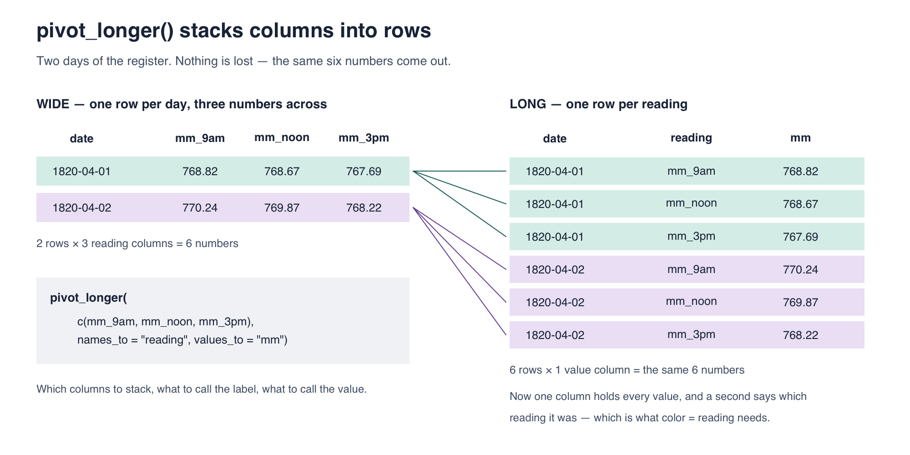

::: callout-important
## Due date

This lab is due **today, by the end of class**. Commit and push your
`lab-05.qmd` and rendered PDF to your own lab repo, and submit that PDF
on Gradescope.
:::

# Introduction

Everyone before Gauss worked forwards: *assume the errors look like
this, therefore the best estimate is that.* In 1809 Gauss ran the
argument **backwards**. He assumed the answer — everybody already
averages their measurements, so take it as given that the average is the
most probable value — and asked what the error curve would have to look
like for that to be true.

Out came the normal curve. And because the normal curve makes least
squares the right thing to do, Gauss had justified least squares.

Today you will build, from scratch, a thing that decides. Given five
measurements and a candidate for the truth, you will write code that
scores how badly that candidate fits — and then score every candidate
and take the winner.

Do it one way and the winner is the **mean**. Change a single line and
the winner is the **median**. Change another and it is the **midrange**.
Three defensible rules, three different answers, one set of numbers.
That is the argument Legendre, Gauss and Laplace were having, and you
will have finished it by the middle of class.

## Learning goals

By the end of this lab you will be able to:

- tell **random error** from **systematic error**, and say which one
  averaging fixes;
- build a plot one layer at a time with `ggplot()`, `aes()`, and a
  `geom_`, and look the rest up on a cheatsheet;
- write your own function, and call it from a **loop**;
- explain why errors must lose their signs before they can be added;
- score every candidate on a grid and find the best one with
  `which.min()`;
- show that minimizing squared errors gives the mean, absolute errors
  the median, and the worst error the midrange;
- read an estimate against its own uncertainty, and say when an effect
  is too small for the data to see.

# Opening activity — how wrong is a room full of people?

**Laptops closed.** Everyone needs a scrap of paper.

## Round 1 — one guess, on your own

**Write down your
best guess at Kat's age.** One number. No conferring, no
ranges. Write it down on the small piece of paper.

That number is a **measurement**. You are the instrument, her age is the
quantity being measured, and your guess might be wrong by some
amount. 

## Round 2 — put the whole class on one chart

Your instructor has written a column of ages down the side of the board,
one per row, and each group has a **different colored marker**.

**Go up and draw one tally mark, in your group's color, on the row for
your guess.** 

Now, in your group, compute two summaries of your four guesses by hand:

| Summary | How to get it |
|---|---|
| Mean | add the four, divide by four |
| Median | the average of the middle two, in order |

Then **send someone up to write your group's letter, in your color, in
the "group means" column** to the right of the tallies, on the row
closest to your group's mean.

## Round 3 — read the chart

With your group:

1. **Find your own color.** How many rows do your group's four marks
   spread across? Now find your group's letter. Is it inside that span,
   or outside it?

2. **Now look at the four letters together.** How many rows do *they*
   spread across, compared with the tally marks? Is any letter out at
   the top or bottom rows where the most extreme marks are?

3. Suppose you had to bet. Would you rather bet on **one tally mark
   picked at random**, or on **one group letter picked at random**? Say
   why, using the chart rather than any formula.

4. Did your group's mean and median come out the same, or different? If
   they differ, which of your four guesses is responsible, and which of
   the two summaries moved?

::: callout-note
## What the chart does and does not show

The tally marks reach across more rows than the letters partly for a
boring reason: there are sixteen marks and only four letters, and more
numbers reach further simply by being more numerous. 

Read the **positions** instead. The letters cluster toward the middle,
and none of them is out at the ends where the more extreme marks are. That
is the real effect and it is not an artifact of counting: an average of
four people is much harder to drag to an extreme than any one person is.
:::

## Round 4 — one bit of information

Your instructor is **not** going to tell you the answer. She will tell
you one thing only: whether the class **over**estimated or
**under**estimated.

5. Before she says it — look at your chart and try to work it out.
   Can you? Is there anything in those sixteen numbers that points one
   way rather than the other?

6. Now she says it. **Did anything on the board predict that?** You have
   a picture of how much the room disagrees with itself. Does it tell
   you how wrong the room is?

7. Knowing the direction, can you now correct your group's estimate?
   What would you still need in order to do it?

8. If nearly everyone leaned the same way, is that the kind of error
   that **averaging more people** would fix? Would sixteen more students
   have helped?

::: callout-tip
## Two kinds of wrong

Your four guesses scattered around your group's own center, and the four
group letters scattered less. That is **random error**, and averaging is
exactly the right tool for it: more guesses, tighter center, and the
$1/\sqrt{n}$ shrinkage you met in lecture.

But if the whole room leans the same way — everybody reads a face as
younger than it is, everybody underestimates a long distance — that is
**systematic error**, and averaging does nothing to it whatsoever.
Sixteen people making the same mistake is still that mistake, reported
with more confidence. A hundred would be worse: the same wrong answer,
now with a tighter spread around it to make it look trustworthy.
:::


## Now open your laptops — Getting your repo

Find your repo beginning with `lab-05` in the
[statistical-history organization](https://github.com/statistical-history).
Clone it in RStudio using **File → New Project → Version Control → Git**
and its SSH address. If you have already cloned it, open that project
and **Pull**.

Open `lab-05.qmd`, enter your name and group, and render once. You
should also see a `data/` folder, which you will need in Part 4.
Keep these instructions beside your working document.

## The question this lab is about

Your group produced two summaries of one set of guesses (mean and median), and they
probably do not agree with each other.

> **Prediction 1.** If you had to report a single number, should it be
> the mean or the median? Vote in your group and record the count.

> **Prediction 2.** In a moment you will write code that scores how
> badly a guess fits. **If we change the rule for what counts as
> "badly," will the best guess change** — or is the best guess simply
> the best guess?


# Part 1 — Record the board

Record your group's vote on Prediction 1 and your answer to Prediction 2.

# Part 2 — Scoring a guess

Your group voted on whether to report the mean or the median. Now we
settle it — not by opinion, but by building something that can decide.

## The measurements

```{r}
#| label: setup
#| eval: true
library(tidyverse)
```

`library(tidyverse)` loads **dplyr**, which you used last week, and also
**ggplot2**, which is today's tool. You do not need a separate
`library(ggplot2)`.

Put the age guesses aside and take a smaller set of numbers, where the
disagreement is sharper: **five readings of the same quantity, made with
the same instrument on the same afternoon.**

```{r}
#| label: five-measurements
measurements <- tibble(
  reading = 1:5,
  value = c(9.8, 10.0, 10.2, 13.9, 14.1)
)
measurements
```

Three agree with each other and two do not, and nobody wrote down which
two were the mistake. Your group's guesses probably had the same shape:
a cluster, and one or two people well outside it.

## A plot is built from layers

Last week you read a pipeline as a sentence: *take this data, then
filter it, then count it.* A ggplot reads the same way, except the steps
join with `+` instead of `|>`, and each step adds a layer to a picture
rather than changing a table.

Every plot needs three things: **the data**, an **aesthetic mapping**
saying which column becomes which visual property, and at least one
**geom** saying what marks get drawn. Run these three chunks separately
and watch each one arrive.

```{r}
#| label: ggplot-nothing
ggplot(data = measurements)
```

An empty grey rectangle. You said which table to draw from and nothing
else, so nothing was drawn.

```{r}
#| label: ggplot-aes
ggplot(data = measurements, mapping = aes(x = reading, y = value))
```

Now there are axes with names and a scale. `aes()` is the **aesthetic
mapping**: *put `reading` along the bottom and `value` up the side*. R
now knows how far across and how far up any mark would go. It still has
not been told to draw one.

```{r}
#| label: ggplot-points
ggplot(data = measurements, mapping = aes(x = reading, y = value)) +
  geom_point(size = 3)
```

`geom_point()` draws one dot per row. **The `+` goes at the end of a
line, never the start of the next one** — that is the most common ggplot
error and R reports it as an unhelpful "object not found".

`size = 3` sits **outside** `aes()`, because it is one fixed value
rather than something looked up per row.

**2.1** How many dots appeared, and what does one dot represent? Which
column controls how far up a dot sits?

::: callout-tip
## Where to look things up

You are not expected to memorize geoms. Keep the
[ggplot2 cheatsheet](https://rstudio.github.io/cheatsheets/data-visualization.pdf)
open in a tab — one page of geoms, one page of everything else — and
reach for it whenever a plot needs something you have not seen.

Today uses six: `geom_point()`, `geom_line()`, `geom_hline()`,
`geom_vline()`, `geom_abline()` and `geom_boxplot()`. The sheet lists
about forty more. It also shows the pairs that are easy to confuse —
`geom_line()` joins points in order of **x**, while `geom_path()` joins
them in the order the **rows** appear, which matters the moment your x
axis is not what orders the data.
:::

## Drawing a guess

A guess at the true value is a horizontal line. `geom_hline()` adds one,
and `labs()` sets the text:

```{r}
#| label: ggplot-guess
ggplot(measurements, aes(x = reading, y = value)) +
  geom_point(size = 3) +
  geom_hline(yintercept = 10, linetype = "dashed") +
  labs(
    x = "reading number",
    y = "measured value",
    title = "Five measurements, and a guess of 10"
  )
```

Layers stack in the order you write them, so the line is drawn over the
points.

**2.2** Change `yintercept` to 12 and render again. Which guess looks
better to you — 10, or 12? Write down your answer and one sentence
saying what "better" meant when you decided.

## The errors

A guess is wrong by a different amount for each reading. Those amounts
are the **errors** — on the plot, the vertical distances from each dot
to the dashed line.

```{r}
#| label: errors
x <- measurements$value

errors <- x - 10
errors
```

**2.3** Which two errors are large, and why? Look back at the plot and
say which dots they belong to.

::: callout-tip
## Two ways to stop the errors cancelling

We want a **single number** saying how badly a guess fits, so that any
two guesses can be compared. The five errors have to be combined into
one.

They cannot simply be added, because they carry signs: an error of $-4$
and an error of $+4$ would cancel to nothing, exactly like two errors of
zero. Whatever we do, every error has to count as positive no matter
which side of the line it fell on. There are two obvious ways to arrange
that:

- **square** each error, or
- take its **absolute value**.

Both are reasonable. We will square first, in the rest of
Part 2, and take absolute values in Part 3.
:::

## One guess, one number

Square the errors and add them up. That single number says how badly a
guess fits, with no cancellation.

```{r}
#| label: sse-by-hand
errors^2
sum(errors^2)
```

**2.4** Do the same for a guess of 12, one line at a time, and say which
of the two guesses scores lower. Does it agree with what you decided in
2.2?

```{r}
#| label: sse-twelve
#| eval: false
# YOUR CODE HERE
```

## Write it once, use it many times

Rather than retyping that for every guess, wrap it in a function of your
own:

```{r}
#| label: sse-function
squared_error <- function(guess) {
  errors <- x - guess
  sum(errors^2)
}

squared_error(10)
squared_error(12)
```

`function(guess)` says the recipe takes one input, which it calls
`guess`. Everything between the braces is the recipe. The last line
inside is what comes back out.

**2.5** Call your function on a guess of 11.6. Is the score lower than
both of the previous two?

## Every guess, not just three

Now make a long list of candidate guesses and score all of them with a
**loop**.

```{r}
#| label: the-grid
grid <- seq(8, 16, by = 0.05)
length(grid)
```

`seq()` builds a regular sequence: 161 candidate values from 8 to 16,
a twentieth apart.

```{r}
#| label: sse-loop
score <- numeric(length(grid))

for (i in seq_along(grid)) {
  score[i] <- squared_error(grid[i])
}

head(score)
```

Read it line by line:

- `numeric(length(grid))` makes an empty container of the right size,
  one slot per candidate.
- `for (i in seq_along(grid))` runs the body once for each position in
  `grid`, with `i` taking the values 1, 2, 3, and so on.
- `score[i] <- squared_error(grid[i])` scores candidate number `i` and
  files the answer in slot `i`.

**This is the new R tool today: a loop.** Everything before this has
happened to whole vectors at once.

## Plot the scores

```{r}
#| label: sse-plot
scores <- tibble(guess = grid, score = score)

ggplot(scores, aes(x = guess, y = score)) +
  geom_line() +
  labs(
    x = "candidate value",
    y = "sum of squared errors",
    title = "How badly each candidate fits the five measurements"
  )
```

`geom_line()` joins the rows in order along the x axis, which is what
you want for a curve. `geom_point()` here would draw 161 dots.

**2.6** Describe the curve in one sentence. Where is it lowest, roughly?

## Find the bottom

```{r}
#| label: sse-min
grid[which.min(score)]
mean(x)
```

`which.min()` returns the **position** of the smallest value, not the
value itself; `grid[...]` then looks up the candidate sitting in that
position.

**2.7** Compare the two numbers. Then compare them with your group's
vote on Prediction 1.

::: callout-note
## What you just found

Of every candidate between 8 and 16, the one with the smallest sum of
squared errors is the **arithmetic mean** — not approximately, exactly.

That is not a coincidence and it is not about this data. It is true for
any set of numbers, and it is the reason least squares and the average
are connected at all. Legendre published the rule "minimize the sum of
squared errors" in 1805 without proving anything about it; Gauss showed
in 1809 what follows from it.

You found it in four lines and a loop.
:::

::: callout-warning
## Render, commit, and push

Render your document, then commit and push before moving on.
:::

# Part 3 — Change the rule, change the answer

Squaring was a choice. Part 2 offered two ways to stop the errors
cancelling — **square** each one, or take its **absolute value** — and
you squared. Now take the other one and see what it gives you.

## Absolute errors instead of squared ones

The tool you need is `abs()`, which takes the **absolute value** of each
number — it throws away the minus sign and leaves everything else alone:

```{r}
#| label: abs-demo
#| eval: true
abs(c(-3, 2, -0.5))
```

**3.1** Now write the second scoring function yourself. Call it
`absolute_error`, give it one input called `guess`, and inside it do the
same two steps as `squared_error` did — find the errors, then combine
them into one number — except that this time you take absolute values
instead of squaring.

```{r}
#| label: sae-function
#| eval: false
absolute_error <- function(guess) {
  # YOUR CODE HERE -- two lines, modelled on squared_error()
}
```

Test it on the same two guesses you used before:

```{r}
#| label: sae-test
#| eval: false
absolute_error(10)
absolute_error(11.6)
```

**3.2** Which of those two guesses scores lower under this rule? Under
the squared rule in Part 2, which scored lower? Do the two rules agree?

## Score every guess again

```{r}
#| label: sae-loop
score_abs <- numeric(length(grid))

for (i in seq_along(grid)) {
  score_abs[i] <- absolute_error(grid[i])
}

ggplot(tibble(guess = grid, score = score_abs),
       aes(x = guess, y = score)) +
  geom_line() +
  labs(
    x = "candidate value",
    y = "sum of absolute errors",
    title = "The same candidates, scored a different way"
  )
```

**3.3** Find the bottom of this curve, then compare it with the **mean**
and the **median** of the five readings. Which one has the rule picked
out this time?

```{r}
#| label: sae-min
#| eval: false
# YOUR CODE HERE -- adapt the two lines from 2.7
```

**3.4** The curve in Part 2 was a smooth bowl. This one is made of
straight pieces joined at corners — and you can probably see two of
them, one near 10 and one near 14. **There are actually five.**

Add a layer marking each reading to find them. `geom_vline()` is the
vertical twin of the `geom_hline()` you used in Part 2:

```{r}
#| label: sae-corners
#| eval: false
ggplot(tibble(guess = grid, score = score_abs),
       aes(x = guess, y = score)) +
  geom_line() +
  geom_vline(xintercept = x, linetype = "dotted", color = "firebrick") +
  labs(x = "candidate value", y = "sum of absolute errors",
       title = "Corners, and the five readings")
```

Where are the five corners? Why do only two of them stand out? And what
changes about the curve as the candidate crosses a reading?

## One more rule

Here is a third, just as defensible: never mind the total, **make the
worst error as small as possible.**

```{r}
#| label: worst-function
worst_error <- function(guess) {
  errors <- x - guess
  max(abs(errors))
}

score_worst <- numeric(length(grid))

for (i in seq_along(grid)) {
  score_worst[i] <- worst_error(grid[i])
}

grid[which.min(score_worst)]
(min(x) + max(x)) / 2
```

Only `sum` became `max`.

**3.5** What summary did this rule pick out? It is the **midrange**,
halfway between the smallest and largest reading — a summary that
ignores everything in between.

## The board

**3.6** Fill this in from your own results. Everyone has all three.

| Rule | Where it bottoms out | Which summary |
|---|---|---|
| Smallest sum of **squared** errors | | |
| Smallest sum of **absolute** errors | | |
| Smallest **worst** error | | |

**3.7** Three reasonable rules, three different answers, one set of five
numbers. Now settle **Prediction 2**: was "which single number should
we report" answerable as you were given it? Name the one thing that was
missing, and say who supplies it — the data, or the person doing the
analysis.


::: callout-warning
## Render, commit, and push

Render your document, then commit and push before moving on.
:::

# Part 4 — When is a number a new piece of information?

The last dataset is real. For eleven years the barometer at the Paris
Observatory was read four times a day — 9 a.m., noon, 3 p.m. and
9 p.m. — and the readings were published.

```{r}
#| label: load-register
#| eval: true
register <- read_csv("data/paris_register.csv", show_col_types = FALSE)
glimpse(register)
```

| Column | Meaning |
|---|---|
| `date`, `year`, `month`, `day` | The day of the reading |
| `mm_9am`, `mm_noon`, `mm_3pm`, `mm_9pm` | Barometer height at each hour, in millimetres |

Nearly four thousand days, four readings each: about **sixteen thousand
numbers**. Laplace used this register to look for a very small effect,
and sixteen thousand observations sounds like plenty.

The question for this part is whether sixteen thousand numbers are
sixteen thousand pieces of information.

## 4.1 — Getting the data into the right shape

Before plotting anything, pull out the month of April in 1820 and the three daytime
readings:

```{r}
#| label: april-wide
#| eval: true
april <- register |>
  filter(year == 1820, month == 4) |>
  select(date, mm_9am, mm_noon, mm_3pm)
head(april)
```

This dataset has one row per day, three readings sitting side by side across the row.
That is a perfectly good shape for reading with your eyes, and the wrong
shape for ggplot.

You want **one line per reading**, and ggplot draws one line per *group* — so it has to be able to find the
reading as **a column it can map**. Right now "which reading" is not
recorded in any column; it is recorded in the column *names*. ggplot
cannot map a column name.

`pivot_longer()` fixes that by stacking the three columns into one:

```{r}
#| label: april-long
#| eval: true
#| output: false
april_long <- april |>
  pivot_longer(c(mm_9am, mm_noon, mm_3pm),
               names_to = "reading", values_to = "mm")
head(april_long)
```

Three arguments: **which columns to stack**, what to call the column
that remembers where each value came from (`names_to`), and what to call
the column holding the values themselves (`values_to`).

Here is the whole operation on two days, small enough to check by eye:

{fig-alt="Two days of the Paris register shown wide, with one row per day and three columns mm_9am, mm_noon and mm_3pm, then the same six numbers shown long, with one row per reading and columns date, reading and mm. Coloured lines join each long row back to the day it came from." width="100%"}

Six numbers go in and six come out. **Nothing is summarised and nothing
is dropped** — it is the same data in a different shape. Wide is usually
easier for a person to read; long is what plotting and grouping want.

**4.1** How many rows does `april` have, and how many does `april_long`?
What is the relationship between the two counts? Say what **one row**
means in each table.

::: callout-note
## While you are counting rows

April has 30 days and `april` has fewer. The register has gaps — days
when the reading was not taken, or not published. Nothing in this lab
depends on them.
:::

## 4.2 — Three readings, one month

```{r}
#| label: three-readings
#| eval: true
ggplot(april_long, aes(x = date, y = mm, color = reading)) +
  geom_point(size = 1) +
  geom_line(linewidth = 0.6) +
  labs(x = NULL, y = "barometer (mm)", color = "Reading",
       title = "Three readings a day, April 1820")
```

Now that `reading` is a column, `color = reading` can map it, and
`geom_line()` draws one line per value it finds there. ggplot adds the
legend by itself. In `labs()`, we specify what we want the title of this legend to be by specifying `color = ...`.
Note that we included `geom_point()` and `geom_line()` and both, the points and the lines, got stacked on the plot together.

**4.2** Describe what the three lines do. Does knowing the 9 a.m.
reading leave you in much doubt about the noon reading?

## 4.3 — The same thing as a scatterplot

A time plot shows two series moving together. A **scatterplot** puts one
against the other directly.

```{r}
#| label: day-scatter
#| eval: true
ggplot(register, aes(x = mm_9am, y = mm_3pm)) +
  geom_point(alpha = 0.12, size = 0.8) +
  geom_abline(slope = 1, intercept = 0, color = "firebrick") +
  labs(x = "9 a.m. reading (mm)", y = "3 p.m. reading (mm)",
       title = "Every day in the register",
       subtitle = "Red line: where the two readings would be exactly equal")
```

With 3,978 points, `alpha = 0.12` makes each one faint so that crowded
regions show up dark — the standard fix for a scatterplot with too many
points to see through.
Let's look ar correlation coefficients for the tree reading times. 

```{r}
#| label: within-day-cor
#| eval: true
register |>
  select(mm_9am, mm_noon, mm_3pm) |>
  drop_na() |>
  cor() |>
  round(3)
```

**4.3** How close to the red line do the points sit? Read the three
correlations. If the 9 a.m. and 3 p.m. readings have a correlaion of 0.97, **how
many independent numbers does one day really give you** — three, or
closer to one?

::: callout-warning
## Render, commit, and push

Render your document, then commit and push before moving on.
:::

## 4.4 — A third view: the change within a day

Laplace did not work with the raw readings. He worked with the **change
within a day** — the 9 a.m. reading minus the 3 p.m. one — because
whatever the weather was doing affected both readings and mostly
cancels out of their difference.

Plot that quantity over the same month:

```{r}
#| label: change-over-time
#| eval: true
change_spring <- register |>
  filter(year == 1820, month == 4) |>
  mutate(change = mm_9am - mm_3pm)

ggplot(change_spring, aes(x = date, y = change)) +
  geom_hline(yintercept = 0, color = "grey70") +
  geom_line(color = "steelblue", linewidth = 0.6) +
  geom_point(color = "steelblue", size = 1) +
  labs(x = NULL, y = "9 a.m. minus 3 p.m. (mm)",
       title = "The within-day change, April 1820")
```

**4.4** Compare this picture with the one in 4.2 — same month. The raw readings swung about 25 mm in smooth multi-day waves.
What does this one do? If you knew Tuesday's value, would you have much
idea about Wednesday's?

## 4.5 — Grouping by month

`data/table_4_2.csv` holds the within-day change already averaged by
month — one value for each month of each year, 1816 to 1826.

```{r}
#| label: load-monthly
#| eval: true
#| output: false
monthly <- read_csv("data/table_4_2.csv", show_col_types = FALSE) |>
  mutate(month = factor(month, levels = c("Jan.", "Feb.", "Mar.", "Apr.",
                                          "May", "June", "July", "Aug.",
                                          "Sept.", "Oct.", "Nov.", "Dec.")))
```

```{r}
#| label: peek-monthly
#| eval: true
glimpse(monthly)
```

**132 rows, one per month-of-a-year**, in the same long shape you made
in 4.1: each row carries its value plus the labels saying which month
and which year it belongs to. Printed on a page this would usually be
laid out as a grid, twelve months by eleven years — but in a data frame
it is a stack of 132 rows, and that is the shape `group_by()` wants.

Because the labels are columns, you can group by **either** of them. A
**boxplot** does exactly that: it splits the rows by a label and draws
one box per group. Each box covers the middle half of that group's
values, the thick line is the median, and isolated points sit far from
the rest.

```{r}
#| label: by-month
#| eval: true
ggplot(monthly, aes(x = month, y = mean_change_mm)) +
  geom_boxplot() +
  labs(x = "month", y = "mean daily change (mm)",
       title = "The same quantity, by month")
```

**4.5** Careful what this axis is measuring. It is **not** how high the
barometer stood — it is **how much it moved between 9 a.m. and 3 p.m.**
A low month is one where the barometer barely shifted over the course of
a day; a high month is one where it swung further.

Describe what you see. Is there a shape across the year, and which
months move most and least?

Then the question that matters: **would you say the eleven observations
in December come from the same distribution as the eleven in April?**
Not "are they equal" — the eleven within December are not equal to each
other either. The question is whether all twenty-two look like they were
generated by one process, or by two different ones.

## 4.6 — Now do it by year

Same plot, with `year` in place of `month`.

```{r}
#| label: by-year
#| eval: false
# YOUR CODE HERE -- adapt the by-month plot
```

::: callout-tip
## One thing will go wrong

`month` arrived as a factor, so ggplot knew to treat it as twelve
separate groups. **`year` is stored as a number**, and on a numeric axis
`geom_boxplot()` has no idea where one group ends and the next begins —
it draws a single box across the whole span and warns you about a
"continuous x aesthetic".

Wrap it: `aes(x = factor(year), ...)`. That tells ggplot the eleven
years are eleven labels, not points on a number line.
:::

**4.6** Describe what you see here too. Then hold the two pictures side
by side: does one of them show a pattern that the other does not?

## 4.7 — Five pictures of one register

You have now drawn the same data five ways: three readings over time,
a scatterplot of 9 a.m. against 3 p.m., the within-day change over
time, a boxplot by month, and a boxplot by year.

**4.7** For each one, write a single sentence saying **what it shows
that the others cannot**. Some prompts, if you are stuck: which plots
would survive if the rows were shuffled into a random order? Which one
would you use to argue that one day gives you roughly one number rather
than three? Which would you use to argue that February is genuinely
different from December?

# Part 5 — AI slot: ask it what "best" means

**Commit before you start.** You did this with Mayer's method in Lab 01.
Predict the failure before you run anything.

Ask an AI tool:

> *Why is the arithmetic mean the best way to combine several
> measurements of the same quantity?*

**5.1** Write your prediction first: what do you expect it to leave out?

**5.2** Now read what it produced. **Does it say best *by what
standard*?** You spent Part 3 establishing that the question has no
answer until a rule is named — squared errors give the mean, absolute
errors the median, worst error the midrange. Check whether the response:

- names a criterion at all, rather than asserting the mean is best;
- mentions that a different criterion gives a different answer;
- mentions the median as a rival, and says when you might prefer it.

**5.3** A response can be fluent, correct in every sentence, and still
answer a question that has not been made well posed. Did yours do the
underdetermined thing you did in the opening activity — pick an answer
without noticing the question was incomplete? Quote the sentence where
it either does or does not hedge.

**Commit again**, so the before-and-after is on the record.

# Wrap-up

::: callout-warning
## Render, commit, push, and submit

Render your document and inspect the PDF. Check that you have written
all three predictions from the opening activity, recorded the board,
attempted each code task, filled in the three-row table in 3.5, answered
the closing questions, and kept commits before and after the AI
activity. Errors with an explanation still count as attempts. Commit and
push the `.qmd` and PDF, then upload that PDF to Gradescope.
:::

**Exit ticket (on paper, with your name):**

1. Muddiest point.
2. One thing you learned today.
3. Favorite holiday.

## References

The historical account follows Stigler, *The History of Statistics*,
ch. 4, pp. 139–160: "Gauss in 1809" and "Reenter Laplace" for the rules
and who preferred which, and "A Relative Maturity: Laplace and the Tides
of the Atmosphere" for Part 4, whose data is Stigler's Table 4.2
(p. 156), sourced there to Bouvard (1827).
